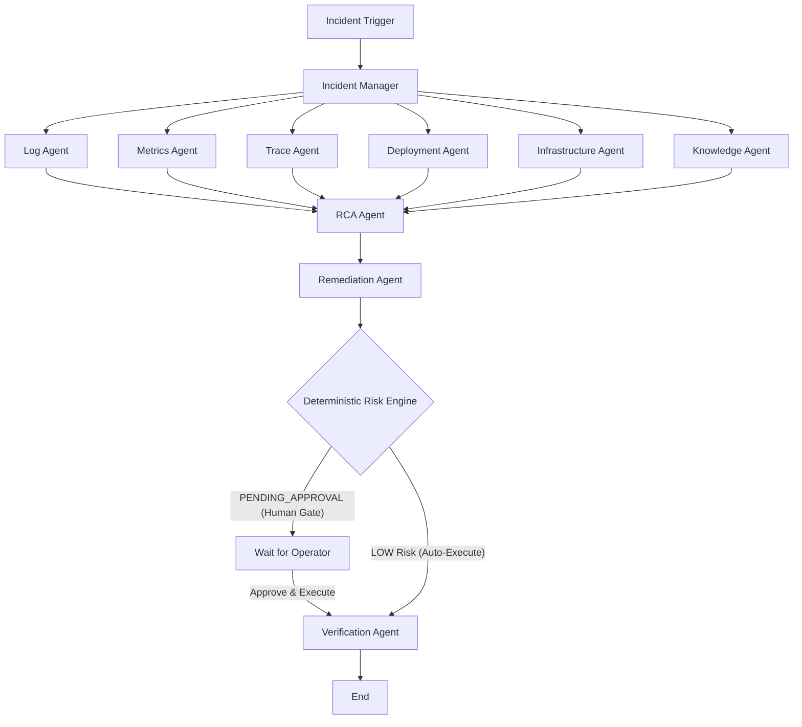
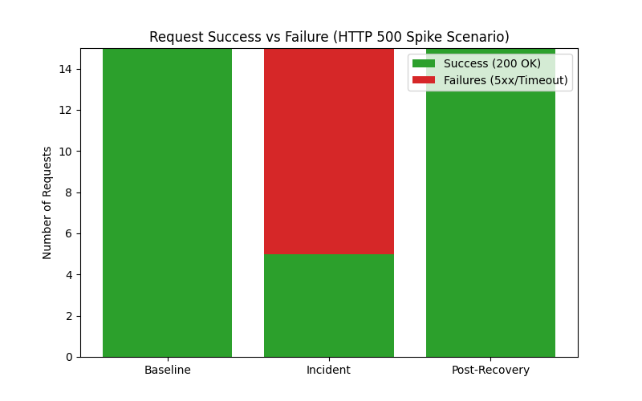
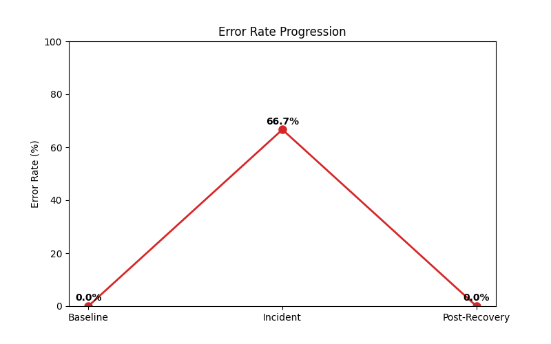
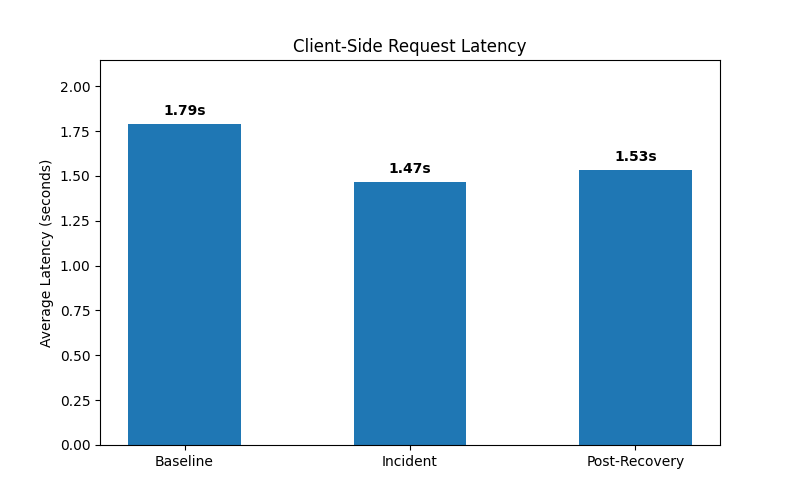

# SentryOps

**Autonomous Multi-Agent Production Incident Response and Root Cause Analysis Platform.**

SentryOps is a specialized, multi-agent AI platform designed to investigate, verify, and remediate production incidents autonomously while operating under strict deterministic safety boundaries. It bridges the gap between observability tools and incident resolution by automatically synthesizing telemetry into actionable, verifiable root-cause analyses.

## Key Capabilities & Technology Stack
- **Simulated Production**: Five FastAPI microservices plus a fault-injection API running on Kubernetes.
- **Observability**: OpenTelemetry, Prometheus, Grafana, Jaeger, Loki.
- **Multi-Agent AI**: Specialized LangGraph agents for logs, metrics, traces, deployment, infrastructure, and historical knowledge (RAG).
- **Controlled Remediation**: Deterministic risk engine, strict human approval gates, and verified execution.
- **Technology Stack**: Python, FastAPI, LangGraph, React, TypeScript, Vite, PostgreSQL, pgvector.

## Multi-Agent Incident Investigation Architecture

SentryOps orchestrates multiple AI agents to investigate incidents. The orchestration is defined using LangGraph and operates as follows:

1. **Trigger**: An incident is created via the backend API (e.g., triggered by an alert).
2. **Fan-Out (Parallel Investigation)**: The `IncidentManager` node fans out the investigation to six specialized agents running in parallel:
   - **Log Agent**: Queries Loki for application errors and logs.
   - **Metrics Agent**: Queries Prometheus for service-level metrics (e.g., HTTP 500 spikes).
   - **Trace Agent**: Queries Jaeger for distributed traces and span failures.
   - **Deployment Agent**: Checks recent deployment and configuration changes.
   - **Infrastructure Agent**: Queries Prometheus for pod and node health metrics.
   - **Knowledge Agent (RAG)**: Uses pgvector similarity search to retrieve relevant historical postmortems and runbooks from PostgreSQL.
3. **Fan-In (Root Cause Analysis)**: The findings from all six agents converge into the `RCA Agent`. This agent synthesizes the collected evidence and generates a Root Cause Analysis.
4. **Remediation & Risk Gate**: The `Remediation Agent` proposes an action. The proposal is evaluated by a **Deterministic Risk Engine** (non-LLM). If the risk is Medium/High, it halts at `PENDING_APPROVAL`.
5. **Execution & Verification**: Once a human operator approves the action, it is executed. The `Verification Agent` then runs deterministically to ensure the service has recovered.

*Note: In the current testing configuration (`MOCK_LLM=true`), the LLM produces a deterministic empty remediation payload to ensure CI stability. Execution is bypassed and simulated via a fault-cleanup endpoint.*



## Application Screenshots and Observability Evidence

The SentryOps frontend provides operators with complete visibility over the incident response lifecycle.

### 1. Main Dashboard

*The main dashboard provides an overview of all incidents, their severities, and the simulated service health metrics.*

### 2. Live Service Metrics (Grafana)

*Grafana dashboard displaying Prometheus metrics, tracking request latency, success rates, and errors across the simulated microservices.*

### 3. Incident Details & AI Investigation

*Detailed incident view showing the AI investigation results.*

### 4. Remediation and Approval

*The remediation section showing the AI's proposal. The deterministic Risk Engine flagged this action for human approval.*

### 5. Post-Recovery State

*The dashboard after the simulated recovery, showing the incident marked as investigating/resolved and service health restored to normal levels.*

## Experimental Methodology and Results

To validate the platform, we ran an automated demonstration (`demo_runner.py`) using the `http_500_spike` fault on the `payment-service`. The runner generated traffic, triggered the fault, created an incident, invoked the AI, and manually cleared the fault to simulate recovery.

Latency and error rates were measured client-side by the demonstration runner using `time.time()` for 10-15 requests per phase.

### Request Success vs Failure

*During the incident, the success rate plummeted due to injected 500 errors.*

### Error Rate Progression

*The error rate spiked to over 50% during the active fault and returned to 0% after cleanup.*

### Request Latency

*Average request latency remained relatively stable but dropped slightly during the incident due to fast-failing HTTP 500 responses.*

## Practical Scenario Walkthrough: Payment Service HTTP 500 Spike

**1. Input Request & Fault Injection**
We injected a simulated HTTP 500 spike fault into the `payment-service` while processing continuous order traffic.
- **Target Endpoint:** `POST /orders`
- **Injected Fault Payload:** `{"fault_type": "http_500_spike", "target_service": "payment-service", "parameters": {"error_rate": 0.8}}`

**2. Observed Output & Incident Creation**
Immediately after fault injection, traffic success dropped.
- **Phase A (Baseline):** 0% Error Rate.
- **Phase B (Fault Active):** >50% Error Rate.
- **Incident Created:** `INC-123456`

**3. AI Investigation & Remediation State**
The AI investigation automatically triggered. Operating under the `MOCK_LLM=true` configuration, it produced a deterministic empty remediation proposal requiring human verification.
- **Remediation Proposed:** `ID: 7` (Empty action payload generated by mock LLM)
- **Status:** `PENDING_APPROVAL`
- **Execution:** `null`

**4. Simulated Recovery**
To bypass the unexecutable mock remediation, the demonstration runner manually cleared the injected fault through the fault cleanup endpoint before collecting post-incident measurements, restoring service health.
- **Phase C (Post-Recovery):** 0% Error Rate.

## Safety Model

SentryOps enforces a strict safety model to prevent destructive AI actions:
- **No Direct Shell/Kubernetes Access**: The LLM cannot execute arbitrary bash scripts or `kubectl` commands.
- **Allow-listed Actions**: Remediations are strictly limited to parameterized `RESTART_SERVICE`, `SCALE_SERVICE`, and `ROLLBACK_SERVICE` actions.
- **Deterministic Risk Policy**: A hardcoded, non-LLM policy engine evaluates the risk of every proposal.
- **Human Approval Gates**: Medium and High-risk actions require explicit operator approval before execution.

## Setup and Reproduction Instructions

### Prerequisites
- Docker Desktop with Kubernetes enabled, minikube, or kind.
- Python 3.10+
- Node.js (for frontend)

### Startup Instructions
1. Deploy the Kubernetes stack:
```bash
./scripts/k8s-deploy.sh
```
2. Forward the required ports:
```bash
kubectl port-forward -n sentryops svc/api-gateway 8080:8000
kubectl port-forward -n sentryops svc/fault-injection 8005:8005
kubectl port-forward -n sentryops svc/backend 8000:8000
```
3. Start the frontend locally:
```bash
cd frontend && npm install && npm run dev
```

### Exact Commands
To reproduce the experimental evidence and charts:
```bash
python demo_runner.py
python generate_charts.py
```
*This script will generate the workload, trigger the incident, output the mock AI remediation proposals, manually clear the fault to simulate recovery, and save the generated charts.*

### Cleanup
To remove the Kubernetes resources:
```bash
kubectl delete namespace sentryops
```

## Testing and Validation Summary

- **Evaluation Framework**: A deterministic evaluation framework evaluates the entire lifecycle (DETECTION -> RCA -> REMEDIATION -> EXECUTION -> VERIFICATION).
- **RCA Validation**: The framework strictly validates evidence linkage against actually collected incident evidence to prevent hallucinations.
- **Safety Testing**: Verified that unauthorized executions are blocked on pending or rejected proposals.

## Known Limitations and Future Extensions

- **Ephemeral Storage**: Observability storage uses `emptyDir` and is not persistent across pod restarts.
- **Mocked AI**: The current `MOCK_LLM=true` configuration produces empty remediations to ensure CI stability. Production integration with a real LLM is required for autonomous remediation execution.
- **Scaling**: One replica per workload; scaling is supported by the API but not automated via HPA.
- **Cloud Deployments**: Terraform and GitOps provisioning for EKS/GKE are out of scope.

<details>
<summary>Detailed Architecture & Phased Implementation History</summary>

## Phase 3 (Fault Injection)
- **Fault Manager**: Exposed via the `fault-injection` microservice API on port 8005.
- **Fault Lifecycle**: INACTIVE -> INJECTING -> ACTIVE -> STOPPING -> INACTIVE.

## Phase 4 (Incident Management Backend)
- **PostgreSQL Persistence**: Schema includes Incident, Evidence, AgentExecution, RootCause, Remediation, Approval, Execution.
- **Investigation Lifecycle**: Basic state machines enforcing DETECTED -> INVESTIGATING -> MITIGATING workflows.

## Phase 5 & 6 (AI Agent Orchestration)
- **LangGraph Orchestration**: Introduced a graph connecting an IncidentManager node to parallel LogAgent, MetricsAgent, TraceAgent, DeploymentAgent, and InfrastructureAgent.

## Phase 7 (Knowledge Base & RAG)
- **PostgreSQL pgvector**: Implemented pgvector for embeddings and similarity search.

## Phase 8 & 9 (Remediation & Verification)
- **Risk Engine**: Deterministically assesses proposals and assigns risk levels.
- **Verification Agent**: Consumes the action result and deterministic checks to produce a structured VerificationResult.

## Phase 10: Operator Dashboard
The frontend dashboard gives operators full visibility into the incident response lifecycle.

## Phase 11 & 12: Incident Replay & Evaluation
- **Deterministic Replay**: Reconstructs the persisted lifecycle.
- **Evaluation Framework**: Evaluates the quality, completeness, and internal consistency of the response lifecycle.

## Phase 13: Kubernetes Deployment
Deploys the existing SentryOps stack to a local Kubernetes cluster using Kustomize.
</details>
