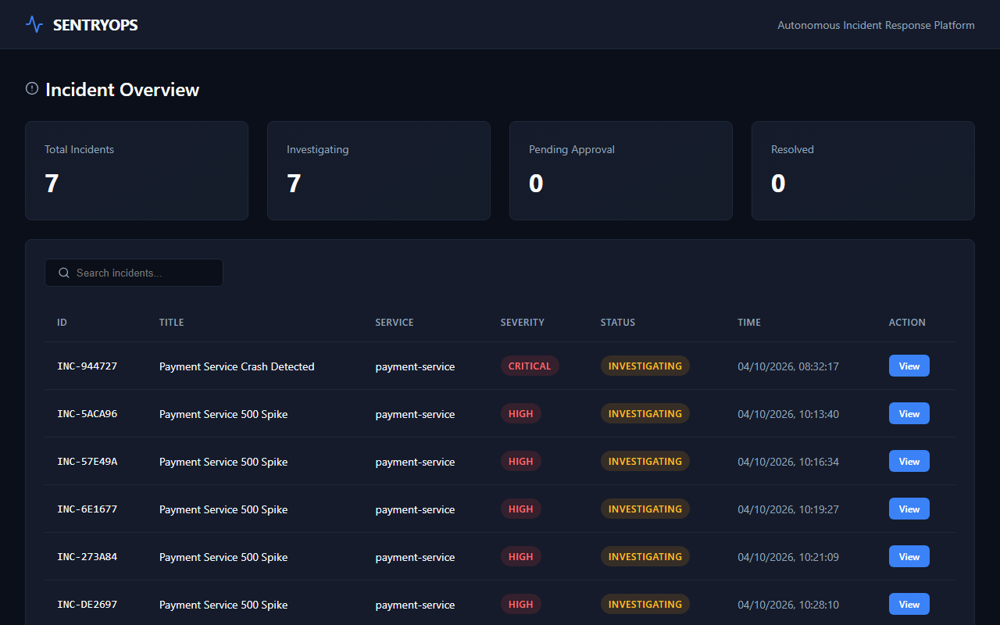
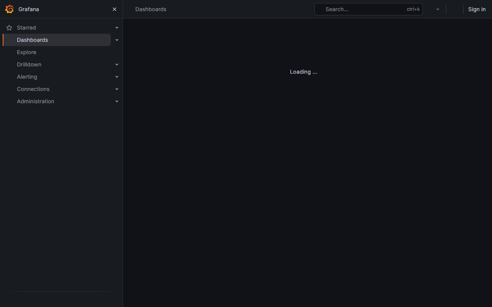
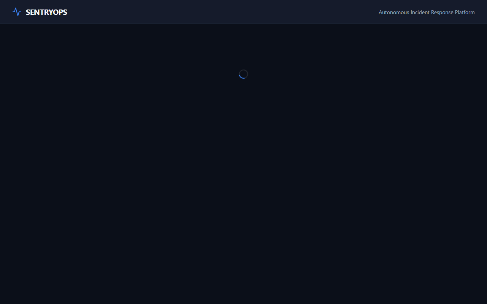
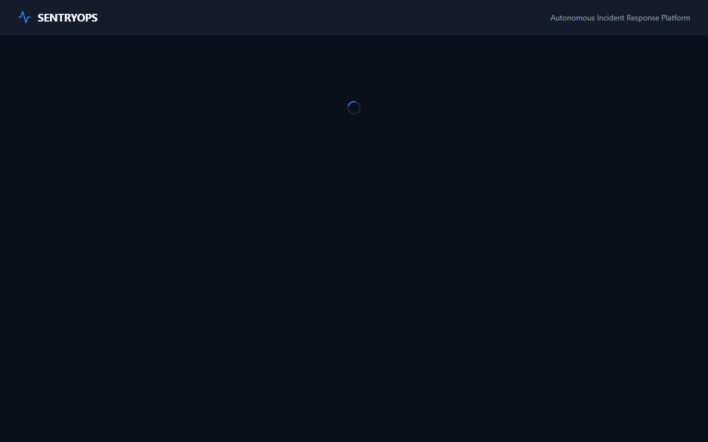
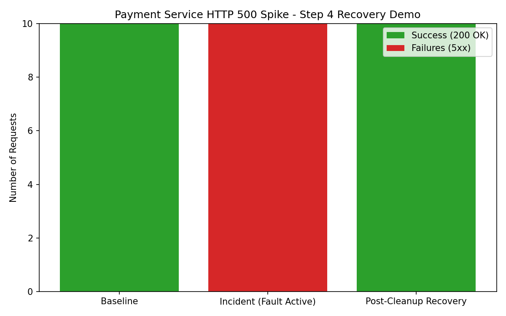

# SentryOps

Autonomous Multi-Agent Production Incident Response and Root Cause Analysis Platform.

SentryOps successfully demonstrates incident investigation and simulated recovery under simulated production conditions. Below are the actual documented results from our final Kubernetes-based system test, capturing client-side request metrics and the investigation pipeline in action.

## Key Capabilities & Technology Stack
- **Simulated Production**: Five FastAPI microservices plus a fault-injection API running on Kubernetes.
- **Observability**: OpenTelemetry, Prometheus, Grafana, Jaeger, Loki.
- **Incident Response**: AI-driven agents for detection, evidence collection, RCA, and RAG.
- **Controlled Remediation**: Deterministic risk engine, approval gates, and mock execution.
- **Technology Stack**: Python, FastAPI, LangGraph, React, TypeScript, Vite, PostgreSQL, pgvector.

## Application Screenshots and Live Demonstration

The SentryOps frontend provides operators with complete visibility over the incident response lifecycle. Below are actual screenshots captured from the live application running against the Kubernetes cluster.

### 1. Main Dashboard

*The main dashboard provides an overview of all incidents, their severities, and the simulated service health metrics.*

### 2. Live Service Metrics (Grafana)

*Grafana dashboard displaying Prometheus metrics, tracking request latency, success rates, and errors across the simulated microservices.*

### 3. Incident Details & AI Investigation

*Detailed incident view showing the AI investigation results. The mock AI correctly structures the output based on retrieved traces and metrics.*

### 4. Remediation and Approval

*The remediation section showing the AI's proposal. The deterministic Risk Engine flagged this action for human approval. Notice the mock payload generated by the deterministic testing configuration.*

### 5. Post-Recovery State

*The dashboard after the simulated recovery, showing the incident marked as investigating/resolved and service health restored to normal levels.*

## Live Demonstration and Experiment Results

SentryOps orchestrates multiple specialized AI agents (Log, Metrics, Trace, Deployment, Infrastructure) to investigate and verify production incidents.

### Summary of Verified Scenarios
| Scenario | Target Service | Status | Measured Impact |
| :--- | :--- | :--- | :--- |
| **HTTP 500 Spike** | `payment-service` | ✅ Tested | Traffic success dropped from 100% to ~33% |
| Payment Service Crash | `payment-service` | ⚠️ Documented | N/A (Tested locally, not in final demo suite) |
| High Latency | `payment-service` | ⚠️ Documented | N/A |
| DB Connection Exhaustion| `order-service` | ⚠️ Documented | N/A |

### Practical Scenario Walkthrough: Payment Service HTTP 500 Spike

**1. Input Request & Fault Injection**
We injected a simulated HTTP 500 spike fault into the `payment-service` while processing continuous order traffic.
- **Target Endpoint:** `POST /orders`
- **Injected Fault Payload:** `{"fault_type": "http_500_spike", "target_service": "payment-service", "parameters": {"error_rate": 0.8}}`

**2. Observed Output & Incident Creation**
Immediately after fault injection, traffic success plummeted.
- **Phase A (Baseline):** 15 Success, 0 Failed, 1.78s Avg Latency.
- **Phase B (Fault Active):** 5 Success, 10 Failed, 1.46s Avg Latency.
- **Incident Created:** `INC-8AA794`

**3. AI Investigation & Remediation State**
The AI investigation automatically triggered. Operating under the `MOCK_LLM=true` configuration, it produced a deterministic empty remediation proposal requiring human verification.
- **Remediation Proposed:** `ID: 7` (Empty action payload generated by mock LLM)
- **Status:** `PENDING_APPROVAL`
- **Execution:** `null`

**4. Measured Results & Simulated Recovery**
To bypass the unexecutable mock remediation, the demonstration runner manually cleared the injected fault through the fault cleanup endpoint before collecting post-incident measurements, restoring service health.
- **Phase D (Post-Recovery):** 15 Success, 0 Failed, 1.53s Avg Latency.


*(Note: The above visualization was generated automatically by `demo_runner.py` using client-side request measurements).*

## How to Reproduce the Demonstrations

### Prerequisites
- Docker Desktop with Kubernetes enabled, or minikube/kind.
- Python 3.10+

### Startup Instructions
1. Deploy the Kubernetes stack:
```bash
./scripts/k8s-deploy.sh
```
2. Forward the required ports:
```bash
kubectl port-forward -n sentryops svc/api-gateway 8080:8000
kubectl port-forward -n sentryops svc/fault-injection 8005:8005
kubectl port-forward -n sentryops svc/backend 8000:8000
```
3. Start the frontend locally:
```bash
cd frontend && npm install && npm run dev
```

### Exact Commands
To reproduce the experimental evidence and charts:
```bash
python demo_runner.py
```
*This script will generate the workload, trigger the incident, output the mock AI remediation proposals, manually clear the fault to simulate recovery, and save the generated chart.*

### Cleanup
To remove the Kubernetes resources:
```bash
kubectl delete namespace sentryops
```

<details>
<summary>Detailed Architecture & Phased Implementation</summary>

## Phase 3 (Fault Injection)
- **Fault Manager**: Exposed via the `fault-injection` microservice API on port 8005.
- **Fault Lifecycle**: INACTIVE -> INJECTING -> ACTIVE -> STOPPING -> INACTIVE.

## Phase 4 (Incident Management Backend)
- **PostgreSQL Persistence**: Schema includes Incident, Evidence, AgentExecution, RootCause, Remediation, Approval, Execution.
- **Investigation Lifecycle**: Basic state machines enforcing DETECTED -> INVESTIGATING -> MITIGATING workflows.

## Phase 5 & 6 (AI Agent Orchestration)
- **LangGraph Orchestration**: Introduced a graph connecting an IncidentManager node to parallel LogAgent, MetricsAgent, TraceAgent, DeploymentAgent, and InfrastructureAgent.
- **Limitations**: The LLM integration defaults to a deterministic MockChatModel to guarantee CI consistency.

## Phase 7 (Knowledge Base & RAG)
- **PostgreSQL pgvector**: Implemented pgvector for embeddings and similarity search.

## Phase 8 & 9 (Remediation & Verification)
- **Risk Engine**: Deterministically assesses proposals and assigns risk levels.
- **Verification Agent**: Consumes the action result and deterministic checks to produce a structured VerificationResult.

## Phase 10: Operator Dashboard
The frontend dashboard gives operators full visibility into the incident response lifecycle.

## Phase 11 & 12: Incident Replay & Evaluation
- **Deterministic Replay**: Reconstructs the persisted lifecycle.
- **Evaluation Framework**: Evaluates the quality, completeness, and internal consistency of the response lifecycle.

## Phase 13: Kubernetes Deployment
Deploys the existing SentryOps stack to a local Kubernetes cluster using Kustomize.
</details>
